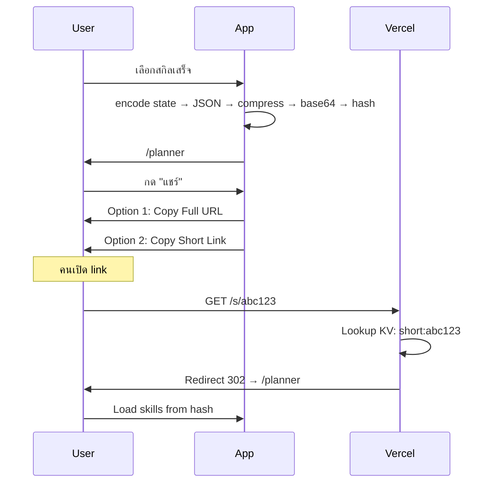

# Phase 2: Shareable Build Links

> **For agentic workers:** REQUIRED: Use superpowers:subagent-driven-development (if subagents available) or superpowers:executing-plans to implement this plan. Steps use checkbox (`- [ ]`) syntax for tracking.

**Goal:** แชร์ build สกิลผ่าน URL ที่ copy ได้ทันที ทั้งแบบ full URL (privacy สูง) และ short URL (ง่ายต่อการแชร์)

**Architecture:** Client-side encoding ด้วย URL hash + Server-side short URL ด้วย Vercel Edge Functions และ KV storage

**Tech Stack:** Next.js 15, Vercel KV (Redis), pako (gzip compression)

---

## Data Flow



---

## Encoding Format

### URL Hash Structure
```typescript
interface BuildShare {
  n: string;      // character name (sanitized)
  s: string[];    // array of base64 skill images (compressed)
  t: number;      // timestamp (for display only)
}
```

### Compression
- Use pako (gzip) to compress JSON before base64 encoding
- Reduces URL size by ~60-70%
- Example: 10 skills = ~200KB raw → ~60KB compressed → ~80KB base64

---

## API Design

### POST /api/shorten

**Purpose:** Create short URL from build hash

**Request:**
```json
{
  "hash": "eyJ..." // compressed, base64-encoded build data
}
```

**Response (201 Created):**
```json
{
  "shortId": "abc123",
  "shortUrl": "https://7k-autoskill.vercel.app/s/abc123",
  "expiresAt": "2026-06-16T00:00:00Z"
}
```

**Error (400):**
```json
{
  "error": "Invalid hash format"
}
```

**Error (429 - Rate Limited):**
```json
{
  "error": "Too many requests. Please try again later."
}
```

---

### GET /api/[id]

**Purpose:** Redirect to full URL with hash

**Response:**
- 302 Redirect → `/planner#<stored_hash>`

**Error (404):**
```json
{
  "error": "Build not found or expired"
}
```

---

## Storage (Vercel KV)

| Key Pattern | Value | TTL |
|------------|-------|-----|
| `build:<shortId>` | `<hash>` | 30 days |

### KV Configuration
```typescript
// next.config.ts
const kv = await unstable_cacheStore.open('kv');
```

---

## Components

### ShareButton Component

**Location:** `components/planner/ShareButton.tsx`

**Props:**
```typescript
interface ShareButtonProps {
  characterName: string;
  skills: Skill[];
  onCopy?: () => void;
}
```

**UI:**
- Button: "แชร์ Build" (gold color)
- Dropdown/Menu:
  - "คัดลอก URL" — copy full URL to clipboard
  - "สร้าง Short Link" — call API, copy short URL

**States:**
- Default: show button
- Loading: spinner while calling API
- Success: toast "คัดลอกแล้ว!"
- Error: toast with error message

---

### ShareModal Component

**Location:** `components/planner/ShareModal.tsx`

**Purpose:** Modal สำหรับแชร์ build (optional alternative to button)

**Content:**
- QR Code (optional, future)
- Full URL input (readonly)
- Copy buttons
- Short URL (if generated)

---

## Page Changes

### app/planner/page.tsx

**On Mount:**
1. Check `window.location.hash`
2. If hash exists:
   - Decode hash → decompress → parse JSON
   - Load skills into state
   - Show toast "โหลด build สำเร็จ!"
3. If no hash: proceed normally (empty state)

**URL Validation:**
- Check hash format (starts with valid prefix)
- Handle corrupted/invalid hashes gracefully
- Show error toast if hash is invalid

---

## Utility Functions

### lib/sharing.ts

```typescript
/**
 * Encode build data to URL hash
 * @param name - character name
 * @param skills - array of skill objects
 * @returns compressed, base64-encoded hash string
 */
export function encodeBuild(name: string, skills: Skill[]): string

/**
 * Decode URL hash to build data
 * @param hash - base64-encoded hash from URL
 * @returns BuildShare object or null if invalid
 */
export function decodeBuild(hash: string): BuildShare | null

/**
 * Validate hash format
 * @param hash - hash string to validate
 * @returns true if valid format
 */
export function isValidHash(hash: string): boolean
```

### lib/compression.ts

```typescript
/**
 * Compress string using pako (gzip)
 * @param data - JSON string to compress
 * @returns compressed Uint8Array
 */
export function compress(data: string): Uint8Array

/**
 * Decompress gzip data
 * @param compressed - compressed Uint8Array
 * @returns decompressed string
 */
export function decompress(compressed: Uint8Array): string

/**
 * Convert Uint8Array to base64
 */
export function toBase64(data: Uint8Array): string

/**
 * Convert base64 to Uint8Array
 */
export function fromBase64(base64: string): Uint8Array
```

---

## Files to Create/Modify

### Create
- `components/planner/ShareButton.tsx`
- `app/api/shorten/route.ts`
- `app/api/[id]/route.ts`
- `lib/sharing.ts`
- `lib/compression.ts`

### Modify
- `app/planner/page.tsx` - add hash reading on mount
- `next.config.ts` - add KV binding (if needed)
- `package.json` - add pako dependency
- `CLAUDE.md` - update directory tree and working rules

---

## Testing Checklist

- [ ] Encode decode roundtrip (name + 10 skills)
- [ ] Copy full URL works
- [ ] Short URL API creates valid short ID
- [ ] Short URL redirect works
- [ ] Invalid hash shows error toast
- [ ] Expired short URL shows "not found"
- [ ] Works on mobile (share intent)
- [ ] Works on Safari/Firefox/Chrome

---

## Privacy Considerations

1. **No Analytics:** Don't track who shares what
2. **No User Accounts:** Build data is anonymous
3. **Server-Side Only Short URLs:** Only store hash, never log IP or user data
4. **Auto-Expire:** Short URLs expire after 30 days
5. **No Third-Party:** All processing happens on our infrastructure

---

## Future Considerations (Not in Phase 2)

- QR Code generation
- Social media preview (og:image)
- Build ratings/voting
- User accounts (save favorites)